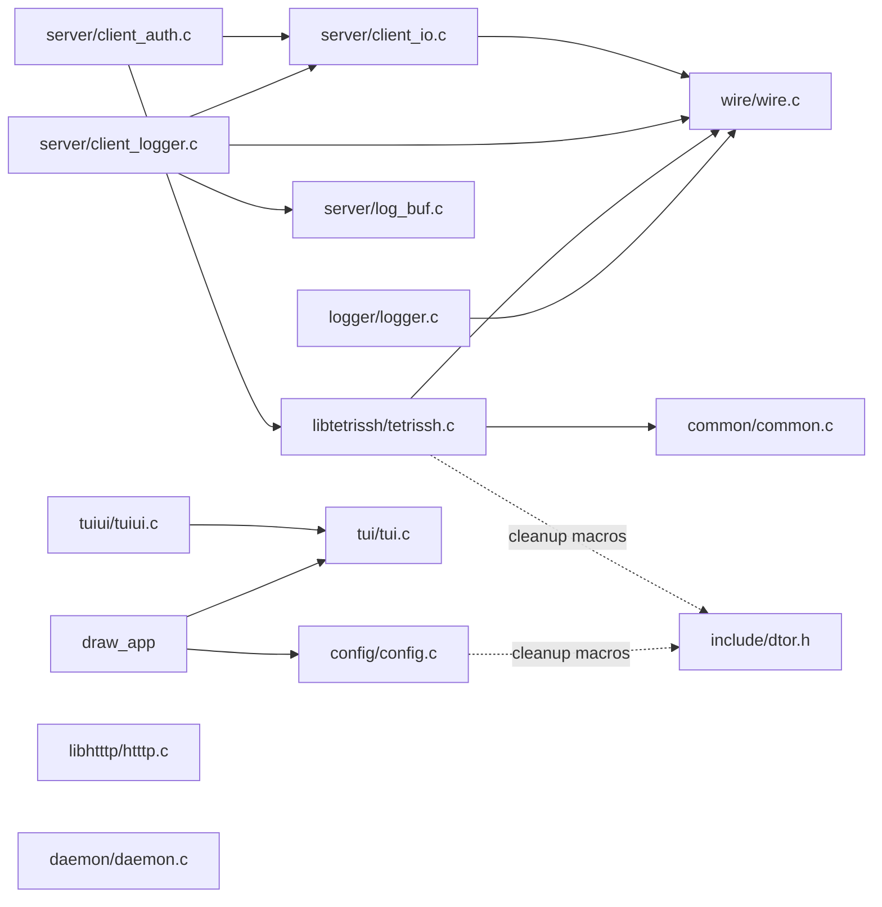
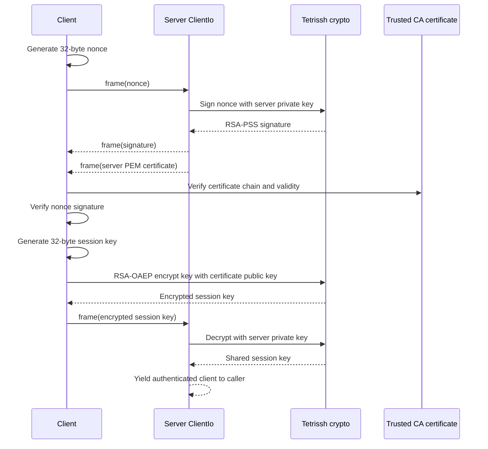
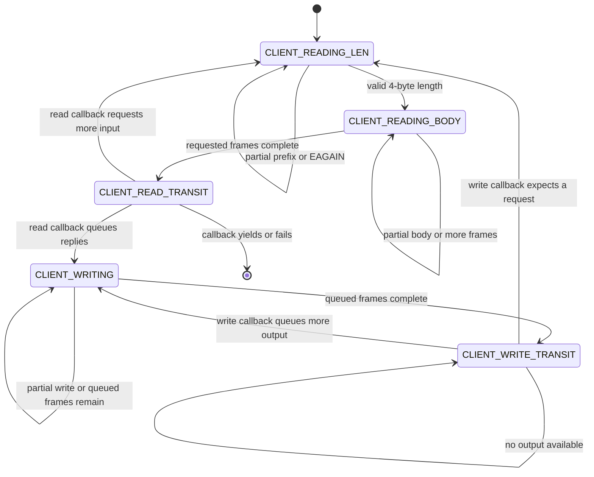
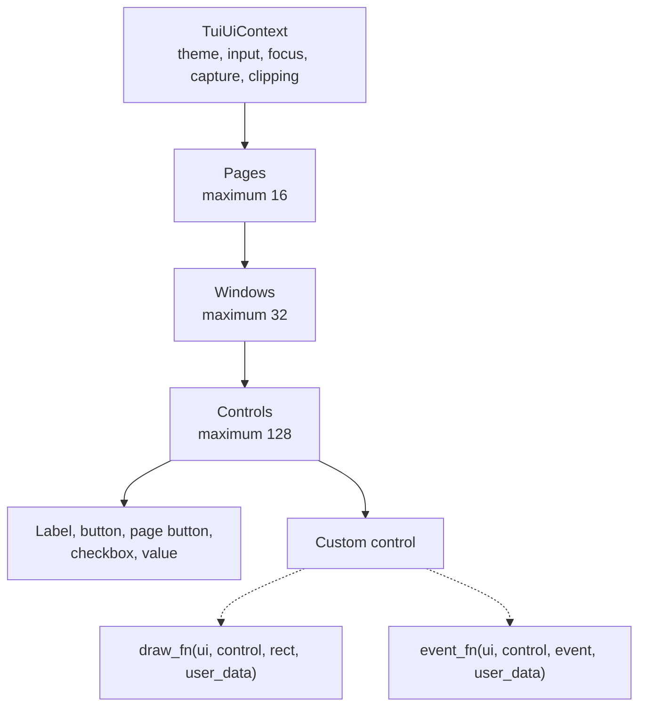
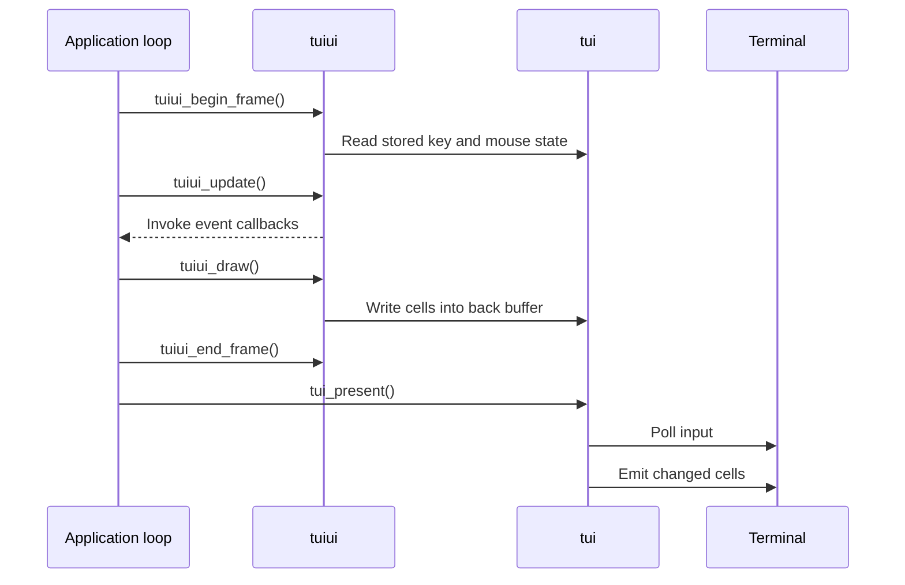

# Source guide

This directory contains reusable C libraries and application entry points for
Tetrish. The root `CMakeLists.txt` builds the libraries plus the minimal
`draw_app` executable.

Public declarations are in [`../include`](../include). Server-internal
interfaces remain beside their implementations in [`server`](server).

## Module map

The arrows below show source-level use: an arrow points from a consumer to the
module or header it relies on.



| Area | Purpose | Main public header |
| --- | --- | --- |
| [`common`](common/README.md) | Socket, certificate, RSA, and symmetric-crypto helpers | [`common.h`](../include/common.h) |
| [`libtetrissh`](libtetrissh/README.md) | Authentication handshake and framed encrypted transport | [`tetrissh.h`](../include/tetrissh.h) |
| [`server`](server/README.md) | Nonblocking framed I/O, server-side authentication, and log delivery | [`server.h`](../include/server.h) and local headers |
| [`logger`](logger/README.md) | Formatted logging to a file or Unix-domain socket | [`logger.h`](../include/logger.h) |
| [`libhtttp`](libhtttp/README.md) | Bounded `HTTTP/1.0` message parsing and serialization | [`htttp.h`](../include/htttp.h) |
| [`config`](config/README.md) | `name=value` configuration loading and typed lookup | [`config.h`](../include/config.h) |
| [`tui`](tui/README.md) | Raw terminal input and diff-based cell rendering | [`tui.h`](../include/tui.h) |
| [`tuiui`](tuiui/README.md) | Retained pages, windows, controls, events, and drawing | [`tuiui.h`](../include/tuiui.h) |
| [`draw_app`](draw_app/README.md) | F1-F9 page buffers, footer composition, and main loop | local [`app.h`](draw_app/app.h) |
| [`daemon`](daemon/daemon.c) | Double-fork daemonization helper | [`daemon.h`](../include/daemon.h) |

The tiny [`wire/wire.c`](wire/wire.c) is intentionally not expanded into its
own section. It only encodes and decodes unsigned 32-bit big-endian values.
Those helpers define the shared frame prefix used by Tetrish, server I/O, and
IPC logging.

## Wire format and secure transport

### Shared framing

The active transport framing is:

```text
4-byte unsigned big-endian payload length | payload bytes
```

The payload length must be in `1..FRAME_MAX` in the nonblocking server reader.
The blocking Tetrish receiver also rejects values above `FRAME_MAX`. A null
session-key pointer makes `tetrish_send_frame` and `tetrish_recv_frame` carry
plaintext; a non-null key encrypts or decrypts the payload.

`common.c` also exposes older 8-byte integer helpers through `common.h`. They
are separate from the 4-byte framing above.

### Authentication handshake

[`libtetrissh/tetrissh.c`](libtetrissh/tetrissh.c) implements the blocking
client side and crypto operations used by the nonblocking server adapter in
[`server/client_auth.c`](server/client_auth.c).



The handshake authenticates the server, not the client:

1. The client proves that the peer holds the private key for a CA-trusted
   certificate by checking a signature over a fresh nonce.
2. The client creates the session key and sends it with RSA-OAEP using
   SHA-256.
3. The server decrypts the key and returns `CLIENT_IO_YIELD` so its owner can
   promote the connection to an authenticated client type.

`TetrishCredential` owns an OpenSSL private key and a heap copy of the PEM
certificate. Initialize it with `tetrish_credential_init` and release both
members with `tetrish_credential_free`.

### Encrypted payloads

The 32-byte session key is split into a 16-byte HMAC key followed by a 16-byte
AES key. `session_encrypt` creates:

```text
16-byte random IV | AES-128-CBC ciphertext with PKCS#7 padding | 32-byte HMAC-SHA256
```

The HMAC covers the IV and ciphertext. Decryption checks the HMAC with
`CRYPTO_memcmp` before attempting AES decryption. All encryption, decryption,
signature, certificate, and RSA functions returning a pointer return newly
allocated data unless their API explicitly says otherwise.

The blocking socket helpers retry until the requested amount is transferred.
They are unsuitable for a nonblocking descriptor; the server uses
`ClientIo` instead.

## Nonblocking server I/O

[`server/client_io.c`](server/client_io.c) is a state machine for a nonblocking
stream socket. It handles the common framing mechanics and delegates
protocol-specific transitions through `transist_read` and `transist_write`
callbacks supplied to `client_io_generic_entry`.



### Frame stack and ownership

`ClientIo` has space for five `ClientIoFrame` objects. Frames are pushed in
reverse array order and consumed from the top, so an array written in logical
send order is transmitted in that same order. Each frame tracks partial use
of its four-byte prefix and body independently.

- `is_heap_allocated=true` transfers ownership of `buf` to `ClientIo`.
  Popping or freeing the frame releases it.
- `is_heap_allocated=false` borrows `buf`; the caller must keep it valid until
  transmission completes.
- `client_io_free` releases owned frame buffers but does not close `ClientIo.fd`.
- Callbacks should return `CLIENT_IO_CONTINUE` after changing state,
  `CLIENT_IO_WOULDBLOCK` when the event loop should wait, `CLIENT_IO_YIELD`
  when the caller must perform a higher-level transition, or an error/close
  result when the connection should be torn down.

### Server authentication adapter

`ClientUnauthed` embeds `ClientIo` as `base`; callbacks recover the containing
object with `offsetof`. It has two protocol states:

- `CLIENT_UNAUTHED_NONCE` reads one nonce frame, queues the signature and
  borrowed certificate as two output frames, then waits for the write to
  finish.
- `CLIENT_UNAUTHED_SYMKEY` reads one encrypted-key frame, decrypts it into
  `ClientUnauthed.key`, and yields.

The owner must keep the referenced `TetrishCredential` alive throughout this
process.

### Log delivery adapter

`LogBuf` is a fixed 512-entry FIFO of owned strings. Appending transfers
ownership. When full, it frees the new string, increments `dropped`, and
returns `-1`. Popping transfers the string to the caller.

`ClientLogger` starts in `CLIENT_WRITE_TRANSIT`. Its write callback moves up to
five queued strings into owned frames, writes them through `ClientIo`, and
returns to the transit state. An empty buffer produces
`CLIENT_IO_WOULDBLOCK`.

## Logging

[`logger/logger.c`](logger/logger.c) has one process-global handler. The
`LOGGER_LOG` macro creates a heap string containing UTC time, source file and
line, severity, group, message, and a trailing newline, then hands ownership
to that handler.

Available handlers are:

- The default null handler, which frees and discards the string.
- A file handler installed by `logger_init_file`; `logger_free_file` closes
  the `FILE *` and restores the null handler.
- A Unix-domain stream handler installed by `logger_init_ipc`. It sends the
  string as a four-byte-length-prefixed frame and frees it afterward.
  `logger_free_ipc` closes the socket and restores the null handler.
- A custom handler installed with `logger_set_log_handler`. It must consume
  the string on every path.

File and IPC output are synchronous. Do not use them directly on a latency
sensitive or nonblocking path without an outer queue.

## HTTTP messages

[`libhtttp/htttp.c`](libhtttp/htttp.c) implements a deliberately named
`HTTTP/1.0` request/response format. It is HTTP-shaped but uses the literal
protocol token `HTTTP/1.0`.

Parsing is bounded by `HTTTP_MAX_MESSAGE`, fixed-size start-line/header fields,
32 headers, and a body length that must exactly match `Content-Length`.
Header lookup is case-insensitive, duplicate `Content-Length` fields are
rejected, and other duplicate headers are retained.

Ownership rules:

- `htttp_message_init` zeroes a message.
- `htttp_set_body` and `htttp_parse` allocate and own a body copy.
- `htttp_message_free` frees the body and resets the whole message.
- `htttp_serialize` returns a newly allocated buffer for the caller to free.
- Header names and values are copied into inline arrays.

Serialization adds `Content-Length` when a non-empty body has no such header.
`htttp_make_response` initializes a response, adds a GMT `Date`, optionally
adds `Content-Type`, and copies a non-empty body.

## Configuration

[`config/config.c`](config/config.c) reads an entire configuration file and
parses up to `CONFIG_MAX_ARGS` directives in this form:

```text
directive=value
```

Leading whitespace before the directive is ignored. Directive names contain
only letters, digits, and underscores. Values are copied as-is up to newline
or carriage return; whitespace around `=` is not trimmed. Blank or malformed
lines are silently skipped, and lookup returns the first matching directive.

`Config` owns every stored name and value. Call `config_free` when finished.
`config_get_path` returns a new string: absolute configured paths are copied,
while relative paths are joined to `project_dir`. `config_get_long_arg`
accepts the numeric bases supported by `strtol(..., 0)` and rejects incomplete
or out-of-range values.

This implementation and `libtetrissh` use the destructor-stack macros from
[`dtor.h`](../include/dtor.h). Registered cleanup functions run in LIFO order,
which keeps error exits from leaking files, OpenSSL objects, or buffers.

## Terminal layers

### Low-level terminal backend

[`tui/tui.c`](tui/tui.c) is a global, single-instance terminal backend.
`tui_init` requires TTY stdin/stdout, saves the terminal settings, enters raw
nonblocking mode and the alternate screen, hides the cursor, and enables SGR
mouse reporting. Always pair a successful initialization with
`tui_shutdown`, including error and signal-exit paths, so the terminal is
restored.

Input polling recognizes ASCII characters, navigation/control keys, and SGR
mouse press, release, drag, position, and wheel events. Key-down state is
inferred from recent input and expires after 180 ms because terminals do not
provide ordinary key-up events.

Rendering uses front and back `TuiCell` buffers. Callers draw into the back
buffer; `tui_present` polls input, writes only changed cells with ANSI escape
sequences, then copies the back buffer to the front buffer. A width-zero cell
marks the second column of a double-width glyph.

### Retained UI layer

[`tuiui/tuiui.c`](tuiui/tuiui.c) stores a fixed-capacity hierarchy:



Pages, windows, and controls are retained in caller-owned `TuiUiContext`
storage. IDs must be nonzero and unique within their object type. Text/value
pointers and `user_data` are borrowed rather than copied, so their storage
must outlive every frame that uses them.

Windows can be bordered, titled, modal, movable, and vertically scrollable.
Controls are clipped to their window content rectangle. Focus follows
registration order, mouse capture ensures a pressed control receives the
matching release, checkboxes toggle on activation, and page buttons change the
active page.

Custom controls receive `FOCUS`, `BLUR`, mouse, click/action, and per-frame
`UPDATE` events through `event_fn`. Their `draw_fn` runs during drawing with
the control's effective screen rectangle and window clipping already active.

A typical frame is:



Because `tui_present` performs polling after the UI update in this ordering,
the input it gathers is consumed by `tuiui_begin_frame` on the next loop
iteration.

Text drawing decodes UTF-8 for output and uses a built-in width heuristic.
Unsupported or malformed sequences become `?`; the low-level character-input
API itself records printable ASCII only.

## Daemonization

[`daemon/daemon.c`](daemon/daemon.c) exposes `incantation`, a traditional
double-fork helper. It returns `0` in either parent (the caller should exit),
`1` in the final daemon child, and `-1` on a reported failure. The daemon
changes to `/`, clears the umask, closes all inherited descriptors, and maps
stdin/stdout/stderr to `/dev/null`.

`setsid()` currently appears inside an `assert`. With `NDEBUG`, the assertion
and the call are compiled out, so release builds do not create the new session.
Move the call outside the assertion before relying on full daemon detachment
in such builds.
