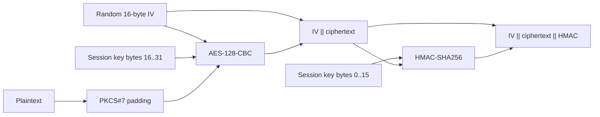

# Common runtime and cryptography

[`common.c`](common.c) implements the shared socket and OpenSSL operations
declared by [`common.h`](../../include/common.h). Higher-level handshake and
framing policy belongs to [`libtetrissh`](../libtetrissh/README.md).

## Responsibilities

- Convert unsigned 64-bit integers to and from eight-byte big-endian buffers.
- Perform blocking, exact-length socket reads and writes.
- Load PEM private keys and X.509 certificates.
- Verify a server certificate against a trusted CA certificate.
- Sign and verify messages with RSA-PSS and SHA-256.
- Encrypt and decrypt one RSA block with OAEP/SHA-256 or PKCS#1 v1.5.
- Generate session keys and protect payloads with AES-128-CBC plus
  HMAC-SHA256.

The eight-byte integer helpers are not the active Tetrish frame prefix.
Tetrish, server I/O, and IPC logging use the four-byte primitives from
[`wire.h`](../../include/wire.h).

## Blocking socket helpers

`read_bytes` allocates a buffer and repeatedly calls `recv` until it has read
the requested length. `send_all` similarly loops until every byte is sent, and
`send_int` writes an eight-byte big-endian integer. These functions treat a
zero return or error as a failed connection and do not expose partial
progress.

Use them only on blocking descriptors. The nonblocking server path uses
[`ClientIo`](../server/README.md), which retains offsets between event-loop
calls.

## Key and certificate operations

`load_private_key`, `load_cert_file`, and `load_cert_bytes` return OpenSSL
objects owned by the caller. Release returned private keys with
`EVP_PKEY_free` and certificates with `X509_free`.

`verify_server_cert` creates a temporary `X509_STORE` containing the configured
CA, then calls `X509_verify_cert`. This checks the certificate signature,
chain, and validity period. It prints the server certificate validity dates
and diagnostic errors directly.

RSA signatures use PSS padding, SHA-256, and maximum salt length. RSA
encryption supports either OAEP with SHA-256/MGF1-SHA256 or PKCS#1 v1.5,
selected by the `use_oaep` argument. Tetrish uses OAEP for its session-key
exchange.

## Session protection

A session key is 32 random bytes:

```text
bytes 0..15: HMAC-SHA256 key
bytes 16..31: AES-128 key
```

Encryption uses an encrypt-then-MAC layout.



`session_decrypt` requires at least one AES block, recomputes and compares the
HMAC with `CRYPTO_memcmp`, and only then decrypts and removes padding. A failed
MAC, invalid padding, malformed length, allocation failure, or OpenSSL error
returns `NULL`.

## Ownership and errors

| Function group | Success value | Ownership |
| --- | --- | --- |
| `read_bytes` | Allocated byte buffer | Caller calls `free` |
| Key/certificate loaders | OpenSSL object | Caller uses the matching OpenSSL free function |
| Signing and RSA helpers | Allocated byte buffer | Caller calls `free` |
| `session_encrypt` / `session_decrypt` | Allocated byte buffer | Caller calls `free` |
| Verification helpers | `1` | No returned allocation |
| Generation/send helpers | `0` | No returned allocation |

Most crypto failures are reported by `print_ssl_error`, which consumes and
prints the newest error from the current OpenSSL error queue.

