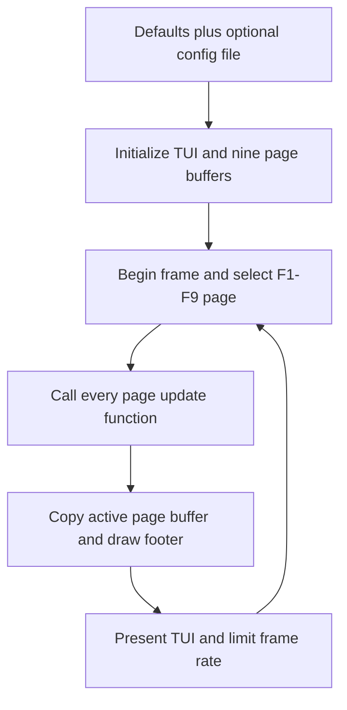

# Draw application frame

`draw_app` is the minimal page-oriented executable built on the low-level
[`tui`](../tui/README.md) backend. It provides nine F-key pages, one private
cell buffer per page, a one-row page footer, configuration loading, and a
Raylib-style update/compose/present loop.

## Startup and configuration

Run with built-in defaults:

```sh
./build/draw_app
```

Or pass a configuration file:

```sh
./build/draw_app src/draw_app/draw_app.conf.example
```

Defaults are assigned explicitly before an optional file is loaded:

| Directive | Default | Meaning |
| --- | ---: | --- |
| `tui_width` | 80 | Total TUI width in cells |
| `tui_height` | 24 | Total TUI height, including the footer |
| `target_fps` | 30 | Main-loop frame limit |

The configuration file uses the `name=value` syntax documented by
[`config`](../config/README.md). Width, height, and FPS must be positive.
Height must leave at least one row above the fixed one-row footer.

## Frame flow



Every `Page` owns an `AppFrame` sized:

```text
tui_width * (tui_height - footer_height)
```

The application calls every registered page update on every frame. `active`
only tells the page whether it is selected; a page that does not need
background work may return early itself. Only the active page buffer is copied
into the TUI back buffer, after which the footer is drawn into the last row.

## Adding page content

The nine handlers in [`pages.c`](pages.c) are intentionally empty shells:

```c
static void page_f1_update(Page *page, const AppFrameContext *context)
{
    (void)context;
    if (!page->active) {
        return;
    }
    /* F1 page implementation goes here. */
}
```

Remove the early return when a page needs to continue updating in the
background. Draw into `page->frame`; do not write directly into
`tui_get_buffer()`. `app_frame_clear` and `app_frame_draw_text` are the initial
bounds-checked frame helpers.

Page definitions are registered from one table. The framework currently caps
the count at nine because the footer and selection keys are F1-F9. `Escape` or
lowercase `q` exits.

## Files

- [`main.c`](main.c): configuration selection, lifetime, and main loop.
- [`app.h`](app.h): page, frame, configuration, and application interfaces.
- [`app.c`](app.c): allocation, input dispatch, composition, timing, and frame
  helpers.
- [`pages.c`](pages.c): F1-F9 page shells and the default registration table.
- [`draw_app.conf.example`](draw_app.conf.example): complete optional
  configuration example.
