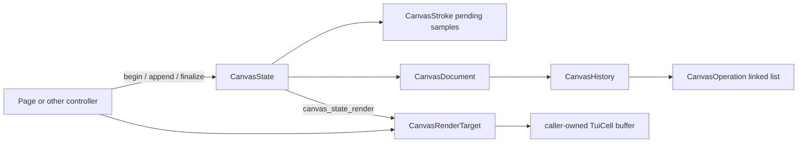
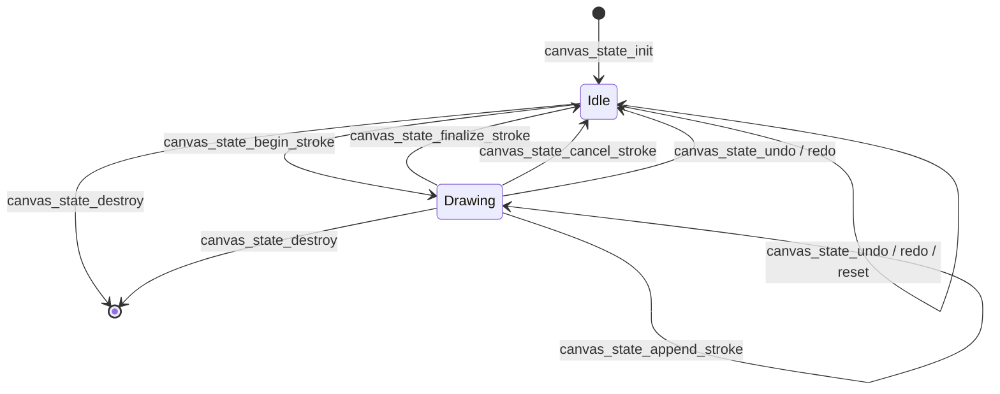

# CanvasState 模块图（临时 Mermaid 源码）

> 正式说明位于 `docs/canvas-state.md`。此文件按设计约定保留 Mermaid
> 源码，便于之后继续修改结构与生命周期图。

```mermaid
flowchart LR
    Controller["Page or other controller"] -->|begin / append / finalize| State["CanvasState"]
    State --> Pending["CanvasStroke pending samples"]
    State --> Document["CanvasDocument"]
    Document --> History["CanvasHistory"]
    History --> Operations["CanvasOperation linked list"]
    Controller --> Target["CanvasRenderTarget"]
    State -->|canvas_state_render| Target
    Target --> Buffer["caller-owned TuiCell buffer"]
```

```mermaid
stateDiagram-v2
    [*] --> Idle : canvas_state_init
    Idle --> Drawing : canvas_state_begin_stroke
    Drawing --> Drawing : canvas_state_append_stroke
    Drawing --> Idle : canvas_state_finalize_stroke
    Drawing --> Idle : canvas_state_cancel_stroke
    Drawing --> Idle : canvas_state_undo / redo
    Idle --> Idle : canvas_state_undo / redo / reset
    Idle --> [*] : canvas_state_destroy
    Drawing --> [*] : canvas_state_destroy
```
