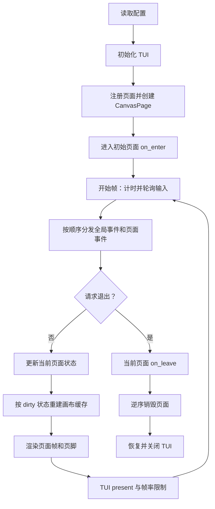
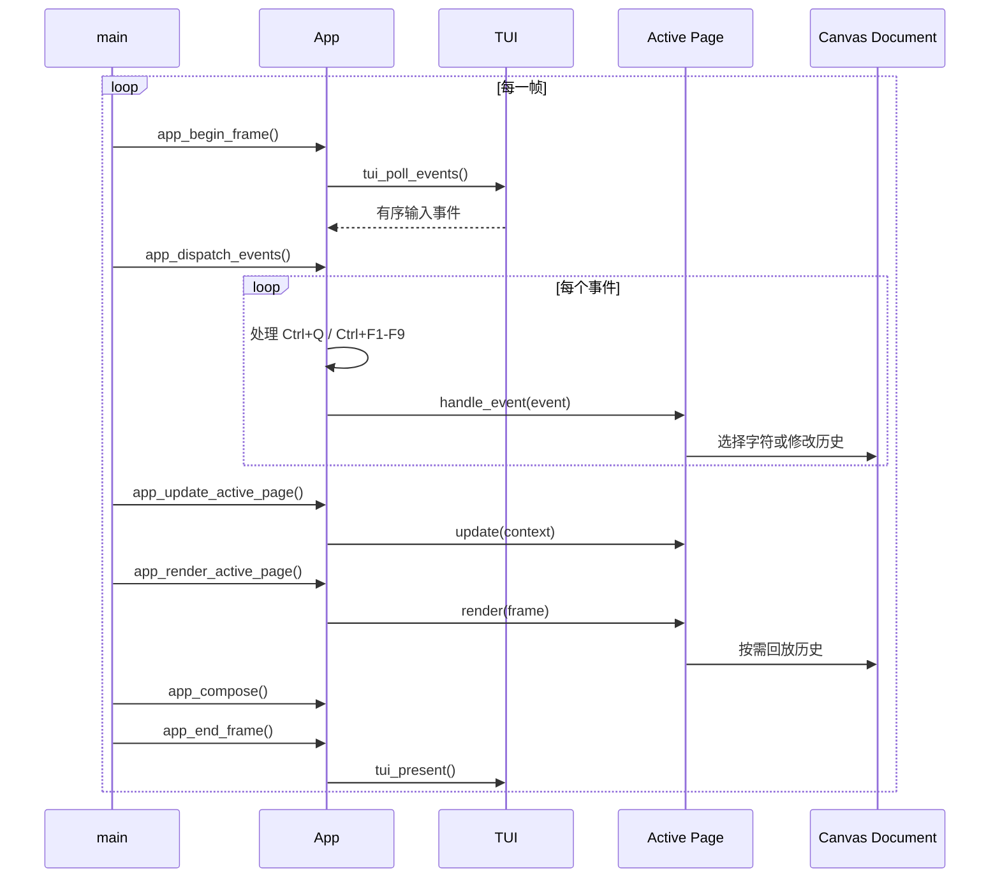

# Canvas 页面循环与生命周期（临时规划稿）

> 此文件用于保存实现前的 Mermaid 规划图，功能落地并迁移到正式文档后可删除。

```mermaid
flowchart TD
    A["读取配置"] --> B["初始化 TUI"]
    B --> C["注册页面并创建 CanvasPage"]
    C --> D["进入初始页面 on_enter"]

    D --> E["开始帧：计时并轮询输入"]
    E --> F["按顺序分发全局事件和页面事件"]
    F --> G{"请求退出？"}
    G -- "否" --> H["更新当前页面状态"]
    H --> I["按 dirty 状态重建画布缓存"]
    I --> J["渲染页面帧和页脚"]
    J --> K["TUI present 与帧率限制"]
    K --> E

    G -- "是" --> L["当前页面 on_leave"]
    L --> M["逆序销毁页面"]
    M --> N["恢复并关闭 TUI"]
```

```mermaid
sequenceDiagram
    participant Main as main
    participant App as App
    participant TUI as TUI
    participant Page as Active Page
    participant Canvas as Canvas Document

    loop 每一帧
        Main->>App: app_begin_frame()
        App->>TUI: tui_poll_events()
        TUI-->>App: 有序输入事件

        Main->>App: app_dispatch_events()
        loop 每个事件
            App->>App: 处理 Ctrl+Q / Ctrl+F1-F9
            App->>Page: handle_event(event)
            Page->>Canvas: 选择字符或修改历史
        end

        Main->>App: app_update_active_page()
        App->>Page: update(context)

        Main->>App: app_render_active_page()
        App->>Page: render(frame)
        Page->>Canvas: 按需回放历史

        Main->>App: app_compose()
        Main->>App: app_end_frame()
        App->>TUI: tui_present()
    end
```

