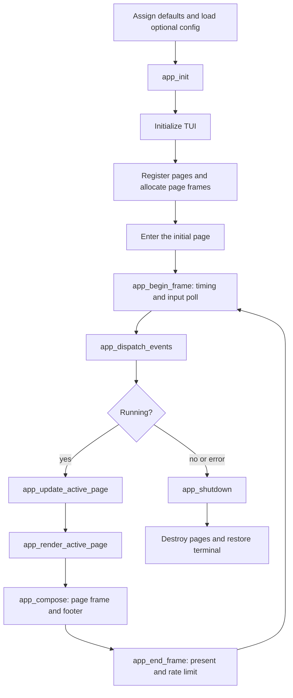
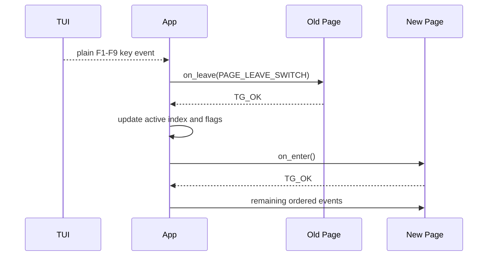

# Application lifecycle

This document describes the `draw_app` process lifetime, per-frame loop and
page callback contract. The declarations are in [`app.h`](../app.h), with the
implementation in [`app.c`](../app.c) and [`main.c`](../main.c).

## Main flow



Input is polled at the beginning of the frame. Events remain ordered, so a page
switch takes effect before later events in the same input batch are delivered.
The active page alone receives page events, updates and rendering calls.

## Page switching



Plain `F1` through `F9` are the only shortcuts without Control. Global
`Ctrl+Q` stops the loop. Other unconsumed events are passed to the active
page's `handle_event` callback.

## Principal structures

### `AppFrame`

Owns the `TuiCell` array rendered by one page:

```c
typedef struct AppFrame {
    TgSizei size;
    TuiCell *cells;
} AppFrame;
```

Its height excludes the global one-row footer. Page code writes to this frame,
not directly to `tui_get_buffer()`.

### `AppFrameContext`

Carries per-frame values to page updates:

| Field | Meaning |
| --- | --- |
| `frame_index` | Number of successfully presented frames |
| `delta_time` | Monotonic seconds since the prior frame |

### `PageOps`

Defines the page lifecycle contract:

| Callback | Responsibility |
| --- | --- |
| `on_enter` | Activate the page and invalidate layout/render caches as needed |
| `on_leave` | Finalize transient work before a switch or shutdown |
| `handle_event` | Mutate page state from one ordered `TuiInputEvent` |
| `update` | Perform time-based work without reading global input |
| `render` | Produce `page->frame` from page state |
| `destroy` | Release page-owned state; must tolerate partial initialization |

Callbacks that can fail return `TgResult`. A failure leaves the main loop
through the common shutdown path.

`PageLeaveReason` distinguishes a normal page switch from application
shutdown, allowing a page to apply different transient-state policies later.

### `Page`

Combines metadata, lifecycle callbacks, its private display frame and opaque
page state:

| Field | Meaning |
| --- | --- |
| `title`, `shortcut` | Footer label and associated F-key |
| `active`, `entered` | Selection and lifecycle state |
| `frame` | Private page display buffer |
| `ops` | `PageOps` implementation |
| `userdata` | Page-specific state, such as `CanvasPage` |

### `AppConfig`

Contains terminal size, Canvas final-output size, FPS and footer height.
`app_config_defaults()` establishes valid values before
`app_config_load()` optionally replaces configured fields.

### `App`

Owns the full process state:

- copied configuration and derived content size;
- fixed array of up to nine `Page` objects;
- current page index and running/TUI-ready flags;
- frame counter and monotonic timing fields.

## Principal functions

### Initialization and shutdown

| Function | Role |
| --- | --- |
| `app_config_defaults` | Assign all built-in configuration defaults |
| `app_config_load` | Parse and validate an optional config file |
| `app_init` | Zero the app, initialize TUI, register pages and enter page 0 |
| `app_add_page` | Allocate a page frame and install its metadata and `PageOps` |
| `app_shutdown` | Leave the active page, destroy pages in reverse order, then shut down TUI |

`app_shutdown()` is the common cleanup path for normal exit, frame errors and
partial initialization failures. TUI shutdown occurs last so every page can
finish while terminal services still exist.

### Per-frame functions

| Function | Role |
| --- | --- |
| `app_begin_frame` | Record timing and call `tui_poll_events()` |
| `app_dispatch_events` | Handle global exit/page keys and route remaining ordered events |
| `app_update_active_page` | Call the active page's `update` hook |
| `app_render_active_page` | Call the active page's `render` hook |
| `app_compose` | Copy the active page frame into the TUI back buffer and draw the footer |
| `app_end_frame` | Present the TUI frame, increment the frame index and enforce target FPS |
| `app_should_close` | Report whether the loop should stop |

### Frame helpers

`app_frame_clear()` resets a full page frame. `app_frame_draw_text()` writes
bounds-checked single-width text into a page frame. Pages may add private
drawing helpers when they need boxes, fills or specialized clipping.

## Ownership and failure rules

1. `App` owns every `Page`.
2. Each `Page` owns its frame allocation.
3. Page `userdata` is owned by the page's `destroy` callback.
4. Page switching never destroys page state.
5. The active page is left before any page is destroyed.
6. Page destruction runs in reverse registration order.
7. TUI is restored after all page-owned resources have been released.

For F2, `CanvasPage` owns a `CanvasState`; that state owns both its pending
sample allocation and the linked operation history. `CanvasRenderTarget`
temporarily borrows `Page.frame.cells` during rendering and does not free or
retain it. See [Reusable canvas state](canvas-state.md) for the complete nested
ownership and lifecycle contract.

The default registration table is in [`pages.c`](../pages.c). F2 installs the
Canvas callbacks; the other pages currently use the no-op placeholder
callbacks.
