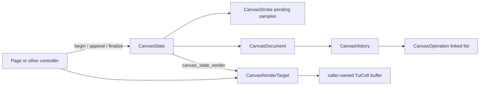
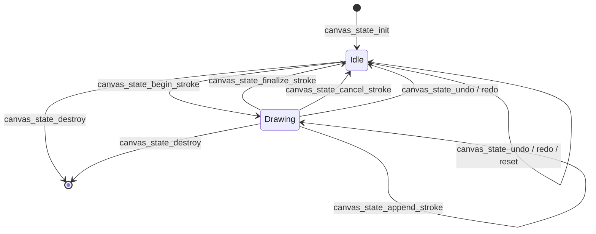

# Reusable canvas state

[`canvas_state.h`](../canvas_state.h) and
[`canvas_state.c`](../canvas_state.c) provide the page-independent editing and
rendering layer used by the F2 Canvas page. A different page can own a
`CanvasState`, submit world-coordinate stroke points, and render the result
into its own contiguous `TuiCell` buffer without depending on `Page`,
`CanvasPage`, terminal input, or F2 layout code.

The lower-level linked-list document remains in [`canvas.h`](../canvas.h) and
[`canvas.c`](../canvas.c). `CanvasState` composes that history with the
currently pending stroke and supplies the higher-level lifecycle used by page
controllers.

## Responsibility boundary



| Layer | Owns | Does not own or decide |
| --- | --- | --- |
| `CanvasDocument` | Applied/redo operation nodes and their copied samples | Pending pointer input, page layout, screen coordinates |
| `CanvasState` | `CanvasDocument` and reusable pending-stroke allocation | Input bindings, palette selection, dirty flags |
| Controller/page | A `CanvasState`, layout, selected cell and UI state | History nodes or pending sample allocation |
| `CanvasRenderTarget` caller | Destination `TuiCell` buffer | Canvas history or stroke samples |

## Principal structures

### `CanvasStroke`

| Field | Meaning |
| --- | --- |
| `active` | Whether a stroke is currently accepting points |
| `cell` | Complete `TuiCell` copied into every newly generated sample |
| `samples` | Owned, dynamically growing pending sample array |
| `sample_count` | Number of pending samples currently in use |
| `sample_capacity` | Reusable allocated capacity |

`canvas_state_append_stroke()` uses Bresenham interpolation from the last
sample to the requested point. It suppresses an adjacent duplicate and
reserves space for the whole segment before appending it, so an allocation
failure does not leave a partially appended segment.

### `CanvasState`

| Field | Meaning |
| --- | --- |
| `document` | Center-relative final-output size and linked-list history |
| `pending_stroke` | Uncommitted samples rendered above applied history |

The document is authoritative. The destination cell buffer is always a
derived render result and is never read back into history.

### `CanvasViewport`

| Field | Meaning |
| --- | --- |
| `rect` | Drawable rectangle in destination-buffer/screen coordinates |
| `origin_screen` | Destination coordinate representing world `(0, 0)` |

Projection uses:

```text
world_x = screen_x - origin_screen.x
world_y = screen_y - origin_screen.y
```

Both conversion functions clip to `rect` and reject values that cannot be
represented by `TgVec2i`. Stored samples therefore remain independent of
terminal dimensions or panel movement.

### `CanvasRenderStyle` and `CanvasRenderTarget`

`CanvasRenderStyle` supplies the inherited foreground and the distinct draft
and final-output hint backgrounds. `CanvasRenderTarget` combines that style
with a viewport and a caller-owned, row-major cell buffer:

```text
cell_count >= size.w * size.h
cell_index = y * size.w + x
```

The module borrows `CanvasRenderTarget.cells` only for the duration of
`canvas_state_render()`; it never stores or frees that pointer.

## State lifecycle



Important lifecycle rules:

`Idle` means only that no pending stroke is active; document history may still
contain applied or redo operations.

- Initialize exactly once before calling editing or rendering functions.
- Beginning a stroke first finalizes an existing active stroke.
- Finalizing deep-copies pending samples into one history operation and retains
  pending allocation for later strokes.
- Canceling discards pending samples without committing and also retains their
  allocation.
- Undo and redo finalize an active stroke before moving the history cursor.
- Reset clears pending state and history but retains the configured output size
  and pending allocation.
- Destroy releases both pending allocation and the complete operation chain.

## Editing and history API

| Function | Contract |
| --- | --- |
| `canvas_state_init` | Zero and initialize state; rejects null state or non-positive output size |
| `canvas_state_destroy` | Release pending samples and all document operations; accepts null |
| `canvas_state_reset` | Cancel pending work and clear history while retaining reusable storage |
| `canvas_state_begin_stroke` | Finalize an existing stroke, capture a complete cell, and add its first point |
| `canvas_state_append_stroke` | Add a Bresenham-interpolated segment; requires an active stroke |
| `canvas_state_finalize_stroke` | Commit all pending samples as one `DRAW_CELLS` operation |
| `canvas_state_cancel_stroke` | Drop the pending sample count without changing history |
| `canvas_state_stroke_active` | Query pending-stroke state |
| `canvas_state_can_undo`, `canvas_state_can_redo` | Query history cursor movement |
| `canvas_state_undo`, `canvas_state_redo` | Finalize pending work and then move the cursor when possible |

The underlying document still exposes `canvas_document_replay()` for consumers
that need replay rather than rasterization.

## Projection and rendering API

| Function | Contract |
| --- | --- |
| `canvas_viewport_screen_to_world` | Convert one in-viewport destination coordinate to centered world space |
| `canvas_viewport_world_to_screen` | Project one world coordinate and reject it when outside the viewport |
| `canvas_state_render` | Rebuild the clipped viewport in a supplied cell buffer |

Rendering order is deterministic:

1. Clip the viewport to destination-buffer bounds.
2. Fill viewport cells with blank cells and draft/final-output hint
   backgrounds.
3. Replay applied document operations from `history.head` through
   `history.cursor`.
4. Overlay the pending stroke.

For a replayed sample, `TUI_COLOR_DEFAULT` foreground inherits
`CanvasRenderStyle.default_fg`; default background inherits the draft or
final-output background at that sample's world position. Explicit sample
colors and style bits are preserved.

`canvas_state_render()` does not mutate `CanvasState`. Re-rendering the same
state, viewport, style and initial buffer region produces the same viewport
contents.

## Reuse from another page

A page normally keeps `CanvasState` in its private state and creates a
short-lived render target for each dirty-frame rebuild:

```c
typedef struct ExamplePage {
    CanvasState canvas;
    CanvasViewport viewport;
    bool frame_dirty;
} ExamplePage;

TgResult example_page_render(ExamplePage *page, AppFrame *frame)
{
    CanvasRenderTarget target = {
        .size = frame->size,
        .cells = frame->cells,
        .viewport = page->viewport,
        .style = {
            .default_fg = 0xd7e0e7u,
            .draft_bg = 0x1a232cu,
            .output_bg = 0x222e39u,
        },
    };
    return canvas_state_render(&page->canvas, &target);
}
```

The controller remains responsible for converting its selected character,
color, and style into a `TuiCell`, translating pointer input through its
`CanvasViewport`, and invalidating its own frame when state changes.

## Current limitations

- Only `CANVAS_OPERATION_DRAW_CELLS` is implemented.
- Rendering targets contiguous buffers with row stride equal to `size.w`.
- Output extraction, serialization and operation-by-operation playback timing
  remain future consumers of the document history.

The state, projection and rendering behavior is covered by
[`canvas_test.c`](../canvas_test.c).
