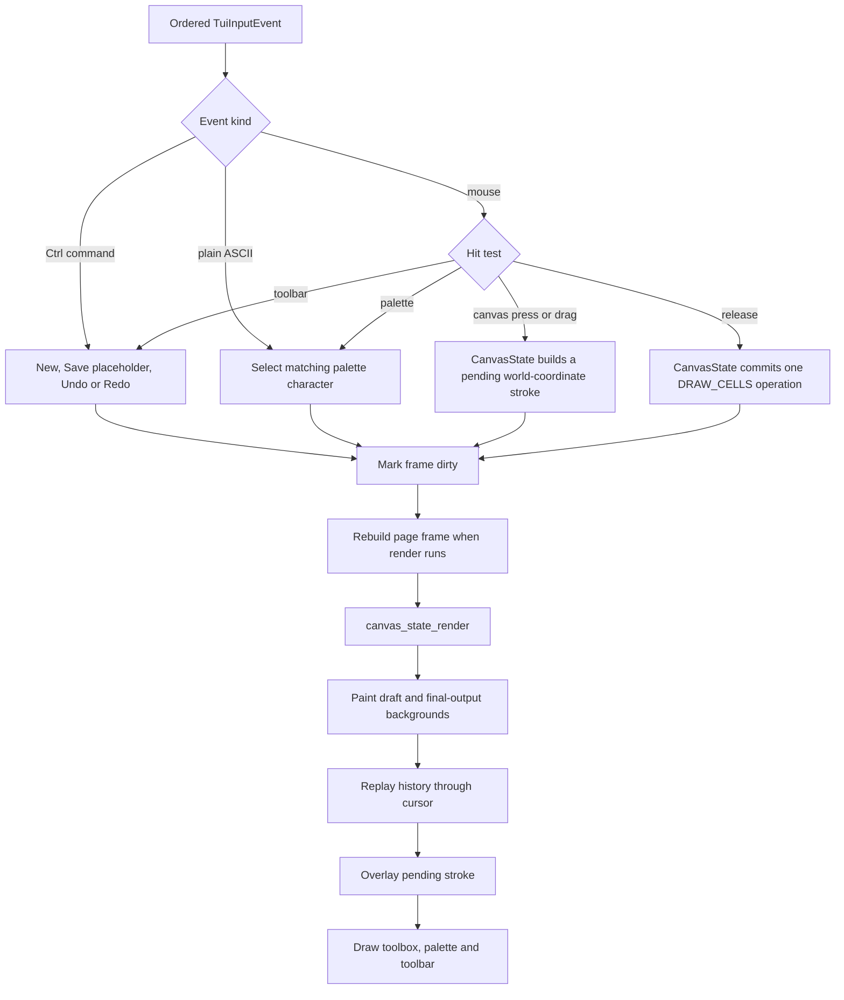

# Canvas page (F2)

The Canvas page is the first implemented `draw_app` page. Its public creation
interface is in [`canvas_page.h`](../../canvas_page.h), its controller and
page chrome are in [`canvas_page.c`](../../canvas_page.c). The linked-list
document model is in [`canvas.h`](../../canvas.h) and
[`canvas.c`](../../canvas.c); reusable stroke maintenance, projection and
rendering are in [`canvas_state.h`](../../canvas_state.h) and
[`canvas_state.c`](../../canvas_state.c). Their complete ownership, lifecycle
and reuse contract is documented in
[Reusable canvas state](../canvas-state.md).

The original layout sketch is available as
[`note_canvas_design.png`](../../design_drafts/canvas/note_canvas_design.png).

## Current scope

The page implements:

- a large visible canvas whose outer cells act as a draft area;
- a centered, configurable final-output region with a subtly different
  background;
- an ASCII 32 through 126 character palette;
- mouse press/drag drawing with the selected character;
- linked-list operation history with undo, redo and replay;
- a disabled Save action and placeholder additional tools.

Saving, loading, output extraction, extra tools and palette editing are
reserved for later work.

## Page event and render flow



## Layout and coordinate system

`CanvasLayout` divides the page frame into:

- an optional left toolbox;
- a central Canvas panel and its drawable viewport;
- an optional right palette;
- a one-row Canvas toolbar above the global application footer.

Narrow terminals hide side panels before allowing the central Canvas panel to
become invalid.

All document operations use world coordinates centered on the final-output
region. They never store terminal positions or backing-array indices:

```text
world_x = screen_x - origin_screen_x
world_y = screen_y - origin_screen_y

output_min_x = -floor(output_width / 2)
output_min_y = -floor(output_height / 2)
```

The output interval is half-open:

```text
[output_min_x, output_min_x + output_width)
[output_min_y, output_min_y + output_height)
```

Y increases downwards to match terminal coordinates. Because history stores
world coordinates, changing the draft viewport or surrounding panel widths
only changes projection; it does not move existing content.

`canvas_viewport_screen_to_world()` is used for mouse input.
`canvas_viewport_world_to_screen()` clips replayed samples to the current
viewport.
`canvas_document_contains_output()` decides which background hint applies and
which cells will belong to the future final output.

## Document and history model

The operation list, rather than a `TuiCell` matrix, is the authoritative
document state:


The page frame is a derived render cache. Each draw operation owns an array of
`CanvasSample` values; every sample contains a world position and a complete
`TuiCell`. This keeps replay independent from the current viewport and leaves
room for later foreground/background/style palette support.

Undo moves `history.cursor` to `prev`. Redo moves it to `next`. Committing
after undo frees the old redo chain before attaching the new operation.
Replay walks from `head` through `cursor`, so the same API can later drive
animation or output generation.

## Principal document structures

### `CanvasSample`

| Field | Meaning |
| --- | --- |
| `position` | Center-relative world coordinate |
| `cell` | Character, width, colors and style written at that coordinate |

### `CanvasHistory`

| Field | Meaning |
| --- | --- |
| `head`, `tail` | Bounds of the doubly linked operation list |
| `cursor` | Last currently applied operation; `NULL` means all operations are undone |
| `operation_count` | Number of nodes, including a possible redo branch |

### `CanvasOperation`

`CanvasOperation` is deliberately opaque in `canvas.h` and defined privately
in `canvas.c`. A node stores:

- a `CanvasOperationType`;
- `prev` and `next` links;
- an owned `CanvasSample` array and its count.

Only `CANVAS_OPERATION_DRAW_CELLS` exists today. Keeping the type discriminator
on every node allows later line, fill or other semantic operations to share
the replay list without changing its ownership rules.

### `CanvasDocument`

Owns the configured `output_size`, its `CanvasHistory`, and a monotonically
increasing `revision`. Draft samples outside `output_size` remain in the same
history and are not discarded.

## Reusable canvas state

`CanvasState` is independent of `Page`, `CanvasPage`, terminal input and the F2
layout. Another page can own one, feed it world-coordinate samples, and render
it into any `TuiCell` buffer by supplying a viewport and colors. This section
describes how F2 integrates it; see
[Reusable canvas state](../canvas-state.md) for the complete module API,
ownership rules, lifecycle and reuse example.

### `CanvasStroke`

Owns the dynamically growing pending `CanvasSample` array, the complete
`TuiCell` copied into each sample, and active/count/capacity metadata. Appending
a point fills the cells between the previous point and the new point with
Bresenham interpolation and suppresses adjacent duplicates.

### `CanvasState`

| Field | Meaning |
| --- | --- |
| `document` | Linked-list history and configured final-output size |
| `pending_stroke` | Uncommitted stroke rendered above applied history |

### Rendering and projection values

| Structure | Role |
| --- | --- |
| `CanvasViewport` | Drawable screen rectangle plus the screen cell representing world `(0, 0)` |
| `CanvasRenderStyle` | Default foreground and draft/output hint backgrounds |
| `CanvasRenderTarget` | Destination size, `TuiCell` buffer, viewport and render style |

`canvas_state_render()` first clears only the viewport to the appropriate
draft/output backgrounds, then replays applied history, then overlays the
pending stroke. A sample that keeps `TUI_COLOR_DEFAULT` inherits the render
target's foreground and region background; explicit sample colors are
preserved.

### Page-private structures

These structures are private to `canvas_page.c`:

| Structure | Role |
| --- | --- |
| `CanvasPalette` | Fixed ASCII entries, selected index and scroll row |
| `CanvasLayout` | Panel/view rectangles, world origin, palette grid and button hit boxes |
| `CanvasPage` | Reusable `CanvasState`, palette, layout, status and dirty flags |

## Principal document functions

| Function | Role |
| --- | --- |
| `canvas_document_init` | Validate output size and initialize an empty document |
| `canvas_document_destroy` | Free the entire operation chain |
| `canvas_document_reset` | Clear history while retaining configured output size |
| `canvas_document_commit_draw` | Copy a stroke into a new operation and truncate redo when needed |
| `canvas_document_can_undo/redo` | Query toolbar and command availability |
| `canvas_document_undo/redo` | Move the applied-history cursor |
| `canvas_document_replay` | Visit every applied sample in chronological order |
| `canvas_document_contains_output` | Test a world coordinate against the final-output bounds |

These functions do not depend on TTY state and are covered by
[`canvas_test.c`](../../canvas_test.c).

## Principal state functions

| Function | Role |
| --- | --- |
| `canvas_state_init/destroy/reset` | Own and release a complete reusable state |
| `canvas_state_begin_stroke` | Finalize any previous stroke, copy a `TuiCell`, and add the first sample |
| `canvas_state_append_stroke` | Append interpolated world-coordinate samples |
| `canvas_state_finalize_stroke` | Commit the pending samples as one history node |
| `canvas_state_cancel_stroke` | Discard the pending samples without changing history |
| `canvas_state_stroke_active` | Query whether an uncommitted stroke exists |
| `canvas_state_can_undo/redo` | Query history movement availability |
| `canvas_state_undo/redo` | Finalize a pending stroke, then move the history cursor |
| `canvas_viewport_screen_to_world` | Convert a clipped screen coordinate to centered world space |
| `canvas_viewport_world_to_screen` | Project and clip a world coordinate into a viewport |
| `canvas_state_render` | Render backgrounds, applied history and the pending stroke to a cell buffer |

## Principal page functions

### Public setup

| Function | Role |
| --- | --- |
| `canvas_page_create` | Allocate the page, initialize the document and seed the ASCII palette |
| `canvas_page_ops` | Return the `PageOps` callbacks installed by page registration |

The initial selected character is `#`. Space is displayed as `SP` in the
palette but retains ASCII value 32.

### Lifecycle callbacks

| Function | Role |
| --- | --- |
| `canvas_page_on_enter` | Compute layout, reveal the selection and invalidate rendering |
| `canvas_page_on_leave` | Finalize a non-empty pending stroke |
| `canvas_page_handle_event` | Route Ctrl commands, plain text and mouse events |
| `canvas_page_update` | Recompute layout when the page frame size changes |
| `canvas_page_render` | Rebuild the page frame only when dirty |
| `canvas_page_destroy` | Destroy its `CanvasState` and free page state |

### Input and command helpers

| Function group | Role |
| --- | --- |
| `canvas_palette_select`, `canvas_palette_hit` | Keyboard/mouse character selection |
| `canvas_page_viewport` | Adapt current page layout to a reusable `CanvasViewport` |
| `canvas_page_finalize_stroke` | Finalize through `CanvasState` and invalidate the page frame |
| `canvas_page_handle_mouse` | Palette, toolbar and Canvas hit testing |
| `canvas_page_new_document/undo/redo` | Implement document commands and status updates |

Changing the selected character finalizes an active stroke first, ensuring one
operation never mixes palette characters. All stroke allocation, interpolation
and history mutation occur through `canvas_state_*`; the page controller does
not maintain its own sample array.

### Rendering helpers

| Function group | Role |
| --- | --- |
| `canvas_frame_put/fill/text/box` | Bounds-checked page-frame primitives |
| `canvas_page_draw_canvas` | Box the panel and invoke `canvas_state_render` |
| `canvas_page_draw_palette` | Render the ASCII grid and selection highlight |
| `canvas_page_draw_toolbox` | Render the current Draw tool and future-tools placeholder |
| `canvas_page_draw_toolbar` | Render actions, availability and status |

The final-output hint background is a presentation concern and is not written
into document history when a sample uses the default background color.

## Input behavior

| Input | Result |
| --- | --- |
| Plain ASCII 32-126 | Select corresponding palette entry |
| Palette left click | Select clicked entry |
| Canvas left press/drag | Draw with selected entry |
| Mouse release | Commit the pending stroke |
| Palette wheel | Scroll when the palette is shorter than its entries |
| `Ctrl+N` | Reset the document |
| `Ctrl+Z` | Finalize the current stroke, then undo |
| `Ctrl+Y` | Finalize the current stroke, then redo |
| `Ctrl+S` | Show the Save-not-implemented status |
| `F1`-`F9` | Leave the page and switch pages |

Mouse release is accepted even outside the Canvas viewport. Drag samples
outside the visible viewport are ignored, while already committed draft
samples remain stored when they later become invisible.
