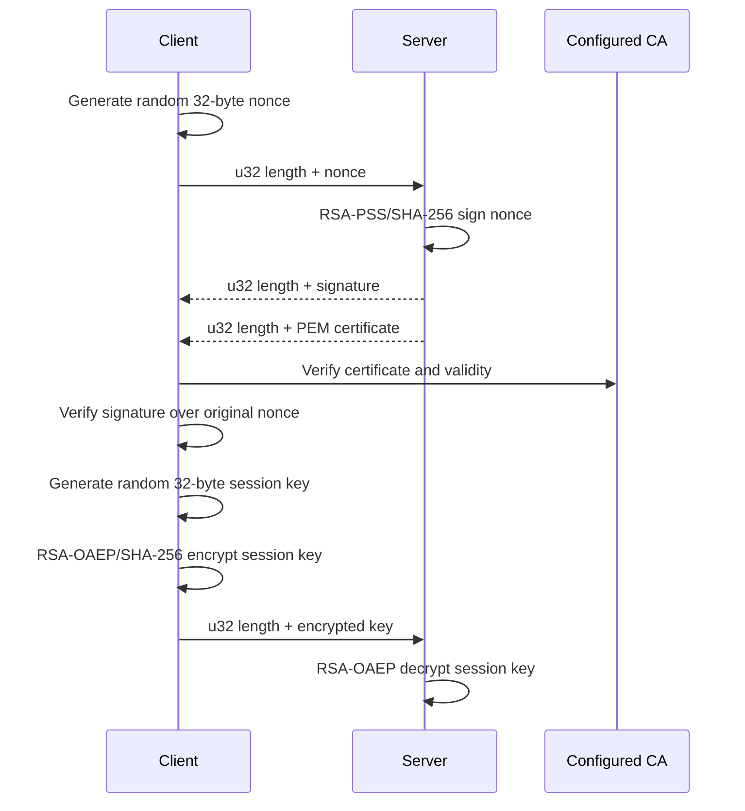

# Tetrissh secure transport

[`tetrissh.c`](tetrissh.c) composes the primitives from
[`common`](../common/README.md) and [`wire.h`](../../include/wire.h) into the
credential, authentication, and framed-transport API declared in
[`tetrissh.h`](../../include/tetrissh.h).

## Credentials

`TetrishCredential` contains:

- An `EVP_PKEY *` loaded from the server's PEM private-key file.
- A heap byte-for-byte copy of the PEM certificate and its 32-bit length.

`tetrish_credential_init` owns both on success. Pair it with
`tetrish_credential_free`. The server authentication adapter borrows this
object, so it must remain alive until every associated handshake finishes.

## Handshake

The client side is blocking. The server-side cryptographic operations are
adapted to nonblocking I/O by [`server/client_auth.c`](../server/README.md).



This proves that the peer holds the private key corresponding to a
CA-trusted server certificate. It does not authenticate the client.

`tetrish_client_handshake` succeeds only after certificate and nonce-signature
verification and transmission of the encrypted session key. The server uses
`tetrish_server_sign_nonce` and `tetrish_server_decrypt_session_key` for the
two cryptographic transitions.

## Framed transport

Every frame begins with a four-byte unsigned big-endian payload length:

```text
u32 payload length | payload
```

`tetrish_send_frame` and `tetrish_recv_frame` take an optional
`SessionKey *`:

- `NULL` sends or returns the payload unchanged.
- A non-null key wraps or unwraps the payload using the authenticated
  encryption format implemented by `common.c`.

Encrypted tokens are `IV || AES-128-CBC ciphertext || HMAC-SHA256`. The token,
not the plaintext, must fit within `FRAME_MAX`, so a plaintext near the limit
can be rejected after encryption overhead is added.

The lower-level `tetrish_session_encrypt` and `tetrish_session_decrypt`
wrappers translate `size_t` lengths to the protocol's 32-bit lengths and
enforce `FRAME_MAX`.

## Blocking and ownership rules

The client handshake and frame send/receive functions loop on the socket until
the requested bytes are transferred. Do not call them on nonblocking server
descriptors.

- `tetrish_recv_frame` returns a newly allocated payload for the caller to
  `free`.
- Server sign/decrypt helpers return newly allocated buffers for the caller to
  `free`.
- Session encrypt/decrypt wrappers return newly allocated buffers for the
  caller to `free`.
- `tetrish_send_frame` retains no caller buffer after it returns.

Temporary objects in this implementation are registered with the destructor
stack from [`dtor.h`](../../include/dtor.h), so error returns release them in
reverse acquisition order.
