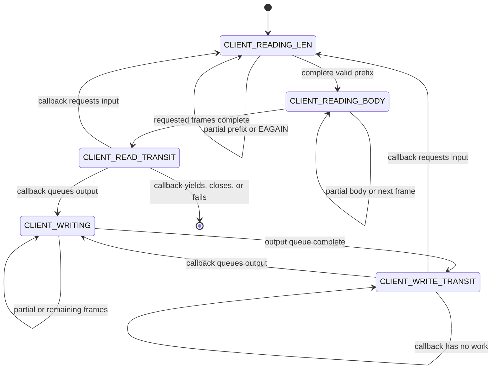

# Server connection helpers

This directory supplies the nonblocking, length-prefixed connection machinery
used by a server event loop. [`client_io.c`](client_io.c) handles generic frame
progress; [`client_auth.c`](client_auth.c) and
[`client_logger.c`](client_logger.c) provide protocol-specific transition
callbacks; [`log_buf.c`](log_buf.c) provides the log queue.

These are libraries, not a complete listener or event loop.

## ClientIo state machine

`ClientIo` retains all partial-read and partial-write offsets between calls.
An event loop repeatedly calls `client_io_generic_entry`, supplying read and
write transition callbacks for the containing client type.

Length prefixes are four-byte unsigned big-endian values. Incoming lengths
must be in `1..FRAME_MAX`. `recv`/`send` interruptions are retried, while
`EAGAIN` and `EWOULDBLOCK` preserve state and return
`CLIENT_IO_WOULDBLOCK`.

## Frame stack

Each connection stores at most `CLIENT_IO_MAX_FRAME` frames. A frame tracks
prefix bytes used, body bytes used, body length, buffer pointer, and ownership.

`client_io_push_frame` accepts frames in logical processing order but copies
the array in reverse because processing uses the top of the internal stack.
For example, pushing `[signature, certificate]` results in the signature being
sent first.

Ownership rules:

- A frame with `is_heap_allocated=true` owns `buf`; popping it calls `free`.
- A frame with `is_heap_allocated=false` borrows `buf`; its producer must keep
  the storage alive until the frame is sent or removed.
- `client_io_free` releases all owned frame buffers.
- `client_io_free` does not close the socket descriptor.

`client_io_transit_state` sets the next state and number of frames to process.
Reading uses unused frame slots until complete bodies are pushed. Writing
consumes already-pushed frames.

## Callback contract

`client_io_generic_entry` owns the mechanical read/write states and invokes
the client-specific callbacks only in `CLIENT_READ_TRANSIT` or
`CLIENT_WRITE_TRANSIT`.

| Result | Event-loop meaning |
| --- | --- |
| `CLIENT_IO_CONTINUE` | State changed; call again while useful |
| `CLIENT_IO_WOULDBLOCK` | Wait for descriptor readiness or new queued work |
| `CLIENT_IO_YIELD` | Return control for a higher-level client transition |
| `CLIENT_IO_CLOSE` | Voluntary connection shutdown |
| `CLIENT_IO_ERR` | Tear down after an I/O or protocol error |

Containing types embed `ClientIo` as `base`. Their callbacks recover the outer
object with `offsetof`, so `base` must refer to a live instance of the expected
type.

## Authentication client

`ClientUnauthed` combines `ClientIo`, a borrowed `TetrishCredential`, a
two-stage authentication state, and storage for the negotiated session key.

1. `CLIENT_UNAUTHED_NONCE` reads one nonce frame.
2. The read callback signs it with
   `tetrish_server_sign_nonce`, queues the owned signature and borrowed
   certificate, and transitions to writing two frames.
3. The write callback transitions to reading one encrypted session-key frame.
4. `CLIENT_UNAUTHED_SYMKEY` decrypts it with
   `tetrish_server_decrypt_session_key`, copies exactly `SESSION_KEY_LEN` bytes
   into the client, and returns `CLIENT_IO_YIELD`.

The caller should promote or replace the client after that yield. The
credential must outlive the handshake because its certificate frame is
borrowed.

## Log queue and logger client

`LogBuf` is a 512-entry FIFO of owned `char *` strings. Appending transfers
ownership. If full, it frees the new record, increments `dropped`, and returns
`-1`. Popping transfers ownership out of the queue; `log_buf_free` frees all
records still present.

`ClientLogger` borrows a `LogBuf` and begins in `CLIENT_WRITE_TRANSIT`. Its
transition callback:

1. Returns `CLIENT_IO_WOULDBLOCK` if the queue is empty.
2. Pops up to the available five-frame capacity.
3. Converts each owned string into a length-prefixed owned frame.
4. Transitions to `CLIENT_WRITING`.

When those frames finish, generic I/O returns to `CLIENT_WRITE_TRANSIT` so the
callback can drain the next batch.

