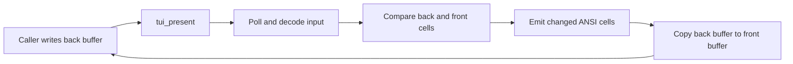

# Terminal backend

[`tui.c`](tui.c) implements the low-level API in
[`tui.h`](../../include/tui.h): raw terminal setup, input decoding, a cell
back buffer, and ANSI diff rendering. The retained widget layer is documented
in [`tuiui`](../tuiui/README.md).

## Lifetime

The backend is a global singleton. `tui_init`:

1. Validates a positive, non-overflowing cell size and requires TTY
   stdin/stdout.
2. Allocates front and back `TuiCell` buffers.
3. Saves terminal attributes and stdin flags.
4. Enters raw, nonblocking input mode.
5. Switches to the alternate screen, hides the cursor, and enables basic,
   drag, and SGR mouse reporting.

Always call `tui_shutdown` after successful initialization. It disables mouse
reporting, restores the cursor, screen, terminal attributes, and descriptor
flags, then frees both buffers. Arrange cleanup for errors and termination
signals so the user's terminal is not left in raw mode.

## Input

`tui_present` reads currently available stdin bytes into an 8192-byte decoder
buffer. Every successful read is also copied into an independent 8192-byte
raw stdin ring before decoding. The decoder recognizes:

- Enter, tab, backspace, space, and escape.
- Arrow, home, end, insert, delete, page-up, and page-down CSI sequences.
- F1-F12 in the common SS3 and numbered CSI forms.
- Printable ASCII character presses.
- SGR mouse position, press, release, drag, and horizontal/vertical wheel
  events.

Special-key decoding is table-driven: one table maps direct CSI final bytes,
one maps SS3 final bytes, and one maps numbered `CSI ... ~` forms. This keeps
the supported-key list separate from parsing control flow.

Per-frame `clicked`, `repeated`, counts, mouse movement, wheel, and release
fields are reset before polling. Terminals do not normally send key-up events,
so `down` state expires when a key has not been observed for 180 ms.

Incomplete escape sequences are not retained for a later poll; a trailing
unmatched escape is recorded as Escape during the current poll.

### Raw stdin copy

The raw ring is separate from the decoder buffer, so consuming or clearing it
does not change key, character, or mouse decoding:

- `tui_stdin_available()` returns the unread byte count.
- `tui_stdin_read(dst, capacity)` consumes bytes in arrival order.
- `tui_stdin_clear()` discards unread bytes.
- `tui_stdin_dropped()` reports how many bytes were overwritten.

The ring persists across frames. When full, a new byte replaces the oldest
unread byte and increments the dropped count. All ring state is reset by
`tui_init`/`tui_shutdown`.

## Cell buffers and rendering

`tui_get_buffer` returns the back buffer. A `TuiCell` holds up to seven UTF-8
bytes plus a terminator, display width, foreground/background RGB colors, and
style bits. `TUI_COLOR_DEFAULT` selects the terminal default color.

The renderer tracks cursor position and active styles/colors to avoid
redundant escape sequences. It skips unchanged cells unless a full redraw is
forced. After a successful flush, the complete back buffer becomes the new
front buffer.

A cell with `width=2` consumes two columns; the following cell is marked with
`width=0` and is not emitted independently. `tui_clear` fills the back buffer
with default single-width spaces.

## Frame timing

Input polling and terminal output both occur inside `tui_present`. Higher
layers that update and draw before calling `tui_present` consume the newly
polled input on their next loop iteration. Call `tui_present` once before the
first UI update if the application needs to prime input immediately.
