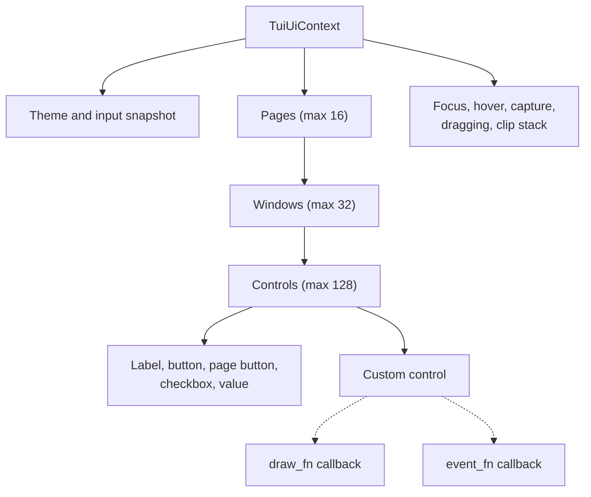
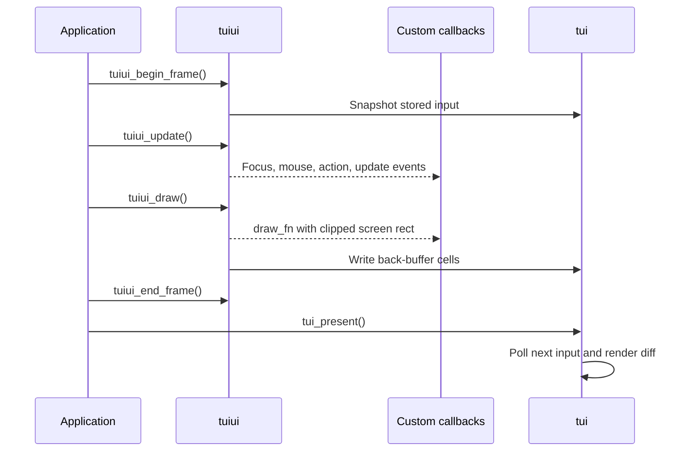

# Retained terminal UI

[`tuiui.c`](tuiui.c) builds pages, windows, controls, event dispatch, and
drawing on the low-level [`tui`](../tui/README.md) cell backend. Its public
types and capacity limits are declared in
[`tuiui.h`](../../include/tuiui.h).

## Retained hierarchy

All UI state lives in caller-owned `TuiUiContext` storage.

IDs must be nonzero and unique within the page, window, or control collection.
The first added page becomes active. Windows refer to an existing page, and
controls refer to an existing window.

Text, value, title, and `user_data` pointers are borrowed. The UI does not copy
or free them, so their storage must remain valid for every frame that may
access them.

## Windows and controls

Windows can be bordered, titled, modal, movable, and vertically scrollable.
Control rectangles are relative to the window content area; vertical scroll
is subtracted when calculating screen coordinates. Hit testing and drawing
intersect controls with the content rectangle.

Built-in controls behave as follows:

| Type | Behavior |
| --- | --- |
| Label | Draws non-focusable text |
| Button | Focusable; activates on captured click or Enter/Space |
| Page button | Button behavior plus a switch to `target_page` |
| Checkbox | Toggles `checked` and sets `CHANGED` on activation |
| Value | Draws a muted label and right-aligned highlighted value |
| Custom | Delegates event and drawing behavior to callbacks |

Registration order determines drawing within a window and keyboard focus
order. Hit testing walks controls and non-modal windows in reverse, so later
objects are treated as visually higher. If an active page has a modal window,
mouse window hit testing is restricted to that modal.

## Frame lifecycle

`tuiui_begin_frame` snapshots key/mouse state, clears transient control flags
except focus, resets hover/clipping, and repairs focus if needed.

`tuiui_update` handles page navigation, scrolling, window dragging, hover,
mouse capture, activation, keyboard focus, and custom update events. A mouse
press captures a focusable control; release activates it only if the pointer
is still over the same control.

`tuiui_draw` fills the screen background, draws active-page windows in
registration order, and then draws each window's controls. `tuiui_end_frame`
is currently a no-op reserved for frame symmetry.

Because `tui_present` polls after this sequence, that input is visible to
`tuiui_begin_frame` on the next loop iteration.

## Custom callbacks

`tuiui_add_custom` stores a `TuiUiCustomDrawFn`, `TuiUiEventFn`, and borrowed
`user_data`.

The event callback can receive:

- `TUIUI_EVENT_UPDATE` once per update while the custom control is visible.
- `TUIUI_EVENT_MOUSE_DOWN` and `TUIUI_EVENT_MOUSE_UP` during capture.
- `TUIUI_EVENT_CLICK` and `TUIUI_EVENT_ACTION` during activation.
- `TUIUI_EVENT_FOCUS` and `TUIUI_EVENT_BLUR` when focus changes.

Every event includes a copy of the frame input snapshot. Event callbacks run
synchronously and may update the context or control.

The draw callback receives the effective screen rectangle. The window content
clip has already been pushed, so it can use `tuiui_draw_cell`,
`tuiui_draw_fill`, `tuiui_draw_text`, and `tuiui_draw_box` without drawing
outside the window.

## Clipping and text

The clip stack holds at most `TUIUI_CLIP_STACK_MAX` rectangles. Each push
intersects the requested rectangle with both the screen and current clip.
An over-capacity push is ignored, so callers adding their own nested clips
must balance pushes and pops carefully.

Text drawing decodes one- to four-byte UTF-8 sequences, substitutes `?` for
malformed input, and uses an internal East Asian/emoji width heuristic.
Zero-width control characters are skipped. Double-width glyphs are written as
one visible `TuiCell` plus a width-zero continuation cell.

## State queries and mutation

`tuiui_clicked` and `tuiui_changed` report transient flags for the current
frame. `tuiui_checked`, `tuiui_focused`, `tuiui_hot`, and `tuiui_active`
inspect retained or interaction state.

Text/value setters only replace borrowed pointers. `tuiui_set_checkbox`
updates retained checkbox state and marks it changed when the value differs.

