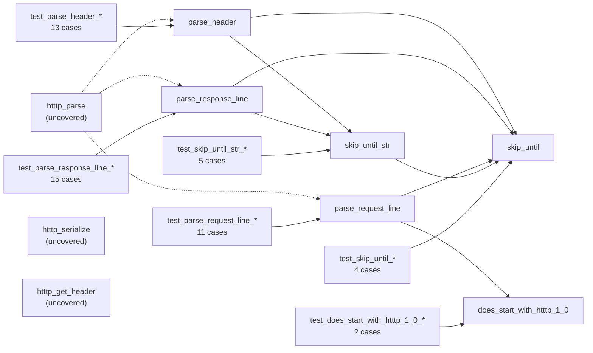

# Unit tests

This directory contains the Unity-based unit tests for the reusable libraries in
this project. At present only [`libhtttp`](../../src/libhtttp/htttp.c) is
covered, by [`test_htttp.c`](test_htttp.c).

`test_htttp.c` includes `../../src/libhtttp/htttp.c` as a source file rather
than linking against the compiled library. The parsing helpers under test are
declared `static` and are not visible through
[`htttp.h`](../../include/htttp.h), so including the translation unit directly
is what makes them reachable by name. The `htttp` target is still linked, which
supplies the public header search path.

## Test map

The arrows below show what each test group exercises: an arrow points from a
test group to the function it calls, and from a function to the helpers that
function relies on. Dotted nodes have no direct coverage.



| Group | Cases | Status | Focus |
| --- | --- | --- | --- |
| `skip_until` | 4 | all pass | delimiter search, exclusive `end`, NUL safety |
| `skip_until_str` | 5 | all pass | multi-byte match, false-positive retry, truncation |
| `does_start_with_htttp_1_0` | 2 | all pass | protocol token match and mismatch |
| `parse_request_line` | 11 | all pass | separator, boundary, version, and CRLF branches |
| `parse_response_line` | 15 | 2 fail | status conversion, range, reason-phrase termination |
| `parse_header` | 13 | all pass | key/value split, header count, retry loop, no trimming |

## Building and running

Configure from the corestack root, then build and run through CTest:

```bash
cmake -S . -B build
cmake --build build --target unit_tests
ctest --test-dir build --output-on-failure
```

Do not configure `tests` as a standalone project with
`cmake -S tests -B tests/build`. In that arrangement `htttp` is not a known
CMake target, so the `PUBLIC` include directory it normally propagates is never
applied, and `${CMAKE_SOURCE_DIR}/include` resolves to a `tests/include`
directory that does not exist. Neither path supplies the real header location
and the build stops with:

```text
fatal error: htttp.h: No such file or directory
```

The same reasoning applies to `${CMAKE_SOURCE_DIR}` when corestack is consumed
as a subdirectory of the Tetrish superproject: it resolves to the superproject
root, not to corestack. The include directory inherited from the `htttp` target
is what makes the current arrangement work, so that line in
[`../CMakeLists.txt`](../CMakeLists.txt) is redundant rather than load-bearing.

## Current status

The suite reports **50 tests with 2 failures**. Both failures are defects in the
tests rather than in the library: each assertion encodes an expectation that
`parse_response_line` was never written to satisfy. A red run is therefore the
expected result today and does not indicate a regression.

| Test | Line | Reported | Actual behaviour |
| --- | --- | --- | --- |
| `test_parse_response_line_invalid_leading_zeros_in_status_code` | 449 | `Expected -1 Was 0` | `00200` is accepted as status `200` |
| `test_parse_response_line_invalid_skip_until_str` | 483 | `Expected -1 Was 0` | an empty reason phrase is accepted as `""` |

### Leading zeros in the status code

The test supplies `"HTTTP/1.0 00200 OK\r\n"` and expects rejection.
`parse_response_line` converts the status token with `strtol(status_start,
&endptr, 10)`. Because the base is given explicitly as 10, `00200` is read as
decimal `200`; the leading zeros are not treated as an octal prefix. `endptr`
then lands exactly on the terminator, so the `endptr != buffer` guard passes,
and `200` falls inside the accepted `[100, 600)` range. No part of the function
requires the token to be exactly three digits.

The same conversion admits and rejects the following, none of which is currently
covered by a test:

| Token | Result | Cause |
| --- | --- | --- |
| `00200` | accepted as `200` | base 10 is explicit, so no octal interpretation |
| `+200` | accepted as `200` | the leading `+` is consumed by `strtol` |
| `-200` | rejected | fails the `status < 100` range check |
| `0x1F4` | rejected | `endptr` stops at `x` and misses the terminator |
| `200abc` | rejected | `endptr` stops at `a` and misses the terminator |

Two resolutions are available and the choice belongs to whoever owns the
protocol:

1. Accept the current behaviour. Change the assertion to expect `0`, add a
   check that `status` is `200`, and rename the test to
   `test_parse_response_line_valid_leading_zeros_in_status_code`.
2. Tighten the parser. Require the status token to be exactly three characters,
   all digits, before calling `strtol`. This also closes the `+200` case and
   leaves the existing assertion correct as written.

The second option matches RFC 9112 and is the safer choice if this parser will
ever exchange messages with an implementation outside this project, because a
peer that normalises the token differently creates a request-smuggling
opportunity. The first option is adequate while the protocol stays internal.

### Empty reason phrase

The test supplies `"HTTTP/1.0 200 \r\n"` and expects rejection on the grounds
that the reason phrase is missing. The parser returns `0` with `status` set to
`200` and `reason` set to the empty string.

The premise does not match the grammar. After consuming the status code and the
space that follows it, `parse_response_line` calls `skip_until_str(&buffer, end,
"\r\n")`, which matches immediately at the current position because the
terminator is already there. The reason phrase is consequently empty, which is
permitted: nothing in the function requires it to contain any bytes, in the same
way that an empty path in `"GET  HTTTP/1.0"` and an empty header value in
`"Host:\r\n"` are accepted elsewhere in the parser. HTTP itself treats the
reason phrase as optional.

Change the assertion to expect `0`, add
`TEST_ASSERT_EQUAL_STRING("", msg.response.reason)`, and rename the test to
`test_parse_response_line_valid_empty_reason_phrase`. The library is correct
here and should not be changed; rejecting an empty reason phrase would introduce
a defect rather than remove one.

## Conventions

`end` is exclusive in every helper. For a string literal, use
`buf + sizeof(buf) - 1` so the compiler-appended NUL is excluded. For a
brace-initialised array such as `{'a', 'b', '\0'}` there is no appended NUL, so
use `buf + sizeof(buf)`; subtracting one there discards a real data byte and
silently changes what the test exercises.

`sizeof(buf) - 1` and `sizeof(buf - 1)` are not equivalent. The second applies
`sizeof` to a pointer, yields 8 on a 64-bit target, compiles without a warning,
and truncates the searchable range to an unrelated length.

Do not assert on output fields after an expected `-1`. All three `parse_*`
functions write their results only on the success path, immediately before
`return 0`, and never write back through `buffer_ref` on failure. Following a
rejection the fields still hold their initial values and the cursor is unmoved,
so the meaningful assertion is that the cursor did not advance.

`parse_header` requires `msg.is_request` to be set before it is called. It
writes through the `ACCESS_MEM` macro, which selects the request or response arm
of the union from that flag. Leaving it `false`, as `{0}` does, files the parsed
header under `msg.response` while the test reads `msg.request`.

Verify byte offsets rather than counting them by eye. Several defects in this
file's history were miscounted pointer offsets that compiled cleanly and
asserted against the wrong position.

## Coverage gaps

No tests currently exercise `htttp_parse` end to end, `htttp_serialize`,
`htttp_get_header`, `htttp_make_rfc_1123_date`, or `htttp_message_free`. The
covered surface is the six `static` helpers only.

A fuzzing campaign of roughly 3.4 million iterations under AddressSanitizer and
UndefinedBehaviorSanitizer, spanning parse, parse/serialize round-trip, and
direct serialize stress, found no memory-safety defect in `libhtttp`. The bounds
logic in the helpers held, the `HTTTP_HEADER_MAX` guard in the `htttp_parse`
loop was respected, and the allocation arithmetic in `htttp_serialize` proved
correct on every path exercised.

The campaign did surface protocol-level findings. The most serious is that
`htttp_serialize` performs no validation of the `key`, `value`, `reason`,
`method`, or `path` bytes it is given. A `\r\n` sequence in any of them splits
the serialized message: a header value of `"hi\r\nX-Injected: pwned\r\n..."`
round-trips into three distinct parsed headers on the receiving side, the
forged one retrievable through `htttp_get_header`. This becomes reachable as
soon as a handler places client-supplied data into a response header. Tests for
that rejection are worth adding once the validation exists.

Secondary findings worth eventual coverage are that `parse_header` itself
enforces no `HTTTP_HEADER_MAX` bound, relying entirely on the guard in its
calling loop; that `htttp_get_header` compares names with `strcmp` and is
therefore case-sensitive, unlike HTTP; and that `htttp_parse` never consults
`Content-Length`, treating everything after the blank line as the body.